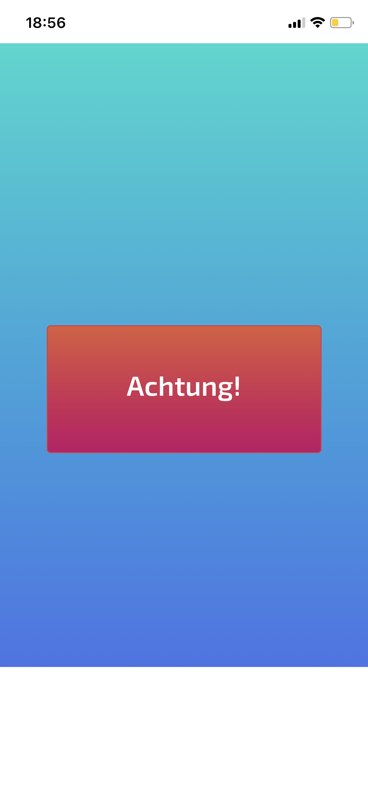
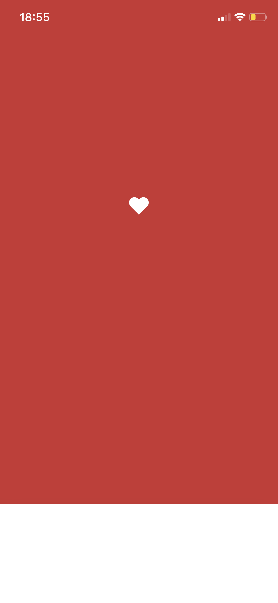
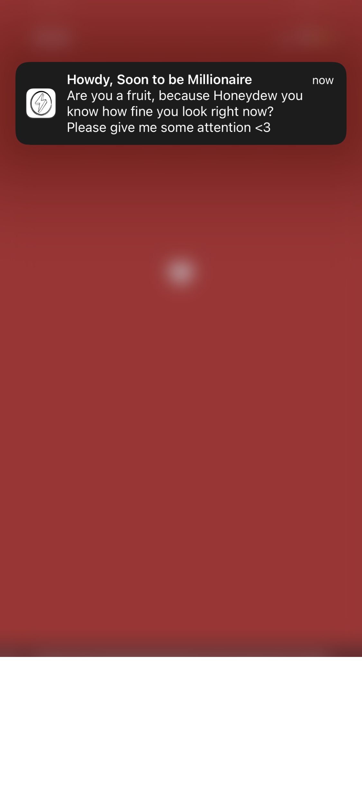

# achtung

Ask your other half for a little attention with a generated message.

<p float="left">
  
   
  
</p>

## Dependencies

1. The [Python3](https://www.python.org/downloads/) interpreter
2. The [Poetry](https://python-poetry.org/) installation tool
3. An account with [MyNotifier](https://www.mynotifier.app/) (free, required to trigger mobile device notifications)

## Quickstart

Download this repository and change into the top-level directory:

```shell
git clone https://github.com/FreddyWordingham/achtung.git
cd achtung
```

Copy the .env.example file to .env and edit it to include your MyNotifier API key, which you can find [at this URL](https://app.mynotifier.app/account):

```shell
cp .env.example .env
open .env
```

Install the dependencies using `poetry`:

```shell
poetry install
```

Start the web server using `uvicorn`:

```shell
poetry run uvicorn achtung.main:app
```

And then visit [http://localhost:8000](http://localhost:8000) in your browser.
You can make the site publicly visible using `ngrok`:

```shell
ngrok http 8000
```
